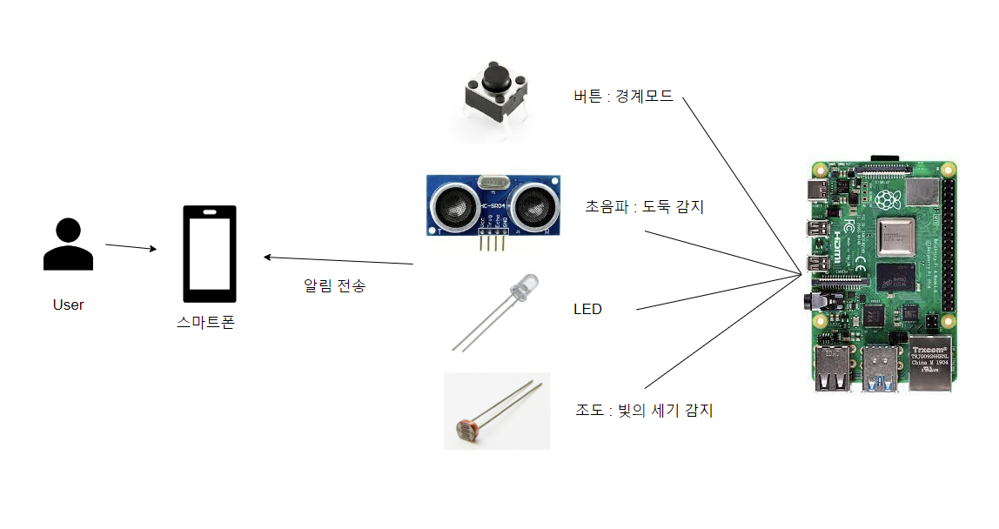

# 2022-2 Embedded Final Project
> ##### 팀원 : 김미령, 백지원, 정재근
> ##### 분반 : 01 / 팀번호 : 02
> ##### 작성자 : 김미령

## 1. 아이디어 소개
* **제목**
  * 안전한 깻잎 농장
* **설명**
  * 깻잎 농사를 지을 때 비닐하우스를 치고 밤마다 항상 불을 켜 놓는다. 
  * 그 이유는 깻잎이 잠을 자게 되면 꽃을 피고 종자를 맺게 되어 깻잎을 못 따기 때문이다.
  * 따라서 밝기가 일정 기준 이하로 떨어지면 자동으로 불이 켜지도록 구현하고자 한다.
  * 또한 주인이 자리를 비운 동안 누군가 침입하지 못하도록 경계 모드동안 일정 거리에 누군가 다가오면 주인에게 알림이 가도록 한다.
* **필요 센서 및 기능**
  * 조도 센서
    * 빛의 세기를 감지하여 낮과 밤을 구분하는 기능
  * LED
    * 밤에 비닐하우스를 밝히는 기능
    * 경계 모드의 활성화, 비활성화를 표시해주는 기능
  * Button
    * 경계 모드의 활성화, 비활성화 기능
  * 초음파 센서
    * 경계 모드 시 일정 거리 안에 누군가 접근하는지 감지하는 기능
  * 블루투스
    * 초음파 센서를 통해 일정 거리 안에 누군가 접근하면 농장 주인의 스마트폰으로 알림을 전송하는 기능

## 2. 전체 시스템 구조

## 3. 제한조건 구현 내용
* **멀티 쓰레드 사용**
  * 빛의 세기 감지 후 LED ON/OFF 기능
    * 조도 센서와 LED를 사용한다.
    * 조도 센서를 통해 빛의 세기를 감지하여 낮인지 밤인지 구분한다.
    * 빛의 세기 감지 후 Bright면 LED를 끄고, Dark면 LED를 킨다.
  * 경계 모드 ON/OFF 기능
    * Button과 LED를 사용한다.
    * Button을 누르면 LED가 켜지면서 경계 모드를 활성화한다.
  * 일정 거리 안에 물체나 사람이 있으면 스마트폰 알림 전송 기능
    * 초음파 센서와 블루투스를 사용한다.
    * 경계 모드가 활성화인 경우 본 기능이 작동한다.
    * 초음파를 통해 거리를 측정하여 누군가 접근하는 것을 감지한다.
    * 일정 거리 안에 누군가 접근하면 농장 주인의 스마트폰으로 알림을 전송한다.
      * 원활한 실험을 위해, 본 테스트에서는 일정 거리를 1500mm 이하로 설정한다.
* **뮤텍스 사용**
  * 뮤텍스를 통해 경계모드 값을 공유 자원으로 사용한다.
  * 첫번째 쓰레드 생성 시 뮤텍스를 초기화하고 마지막 쓰레드 생성 시 뮤텍스를 제거한다.
  * 경계모드의 값을 설정하는 쓰레드 안에서 뮤텍스를 이용하여 임계 구역을 진입할 때 객체를 잠그고 임계 구역이 끝날 때 푼다.
    * 임계 구역 : 경계모드의 상태를 설정하는 Button의 값을 읽어올 때부터 읽어온 값이 HIGH고 현재 경계모드가 LOW인 경우 경계모드의 상태를 LOW에서 HIGH로 바꾼 후까지

## 4. 가산점 요소
* 라즈베리파이와 스마트폰 간 통신 사용
  * 블루투스 사용
  * 초음파를 통해 일정 거리 안에 누군가 접근하면 농장 주인의 스마트폰으로 알림을 전송한다.

## 5. 개발 시 문제점 및 해결방안
* 문제점1 : 스마트폰으로 알림을 전송할 때, 시리얼 통신에 보낼 데이터가 있고 일정 거리 이하인 경우 전송하도록 조건을 준 결과, 작동하지 않았다.
  * 해결 방안 : 시리얼 통신에 보낼 데이터의 유무는 검사하지 않고 일정 거리 이하면 바로 스마트폰으로 알림을 전송하도록 하였다.

## 6. 기능별 데모 영상
* 빛의 세기 감지 후 LED ON/OFF 기능
  
* 경계 모드 ON/OFF 기능
  
* 누군가 일정 거리 안에 다가오는지 감지하는 기능    
  
* 일정 거리 안에 물체나 사람이 있으면 스마트폰 알림 전송 기능
  

## 7. 개발 일정

## 8. 업무 분장
* 김미령
  * 회로 설계, 시스템 개발, 발표자료 제작, 최종 보고서 작성
* 백지원
  * 회로 설계, 시스템 개발, 발표자료 제작 
* 정재근
  * 회로 설계, 시스템 개발, 제안발표, 최종발표
